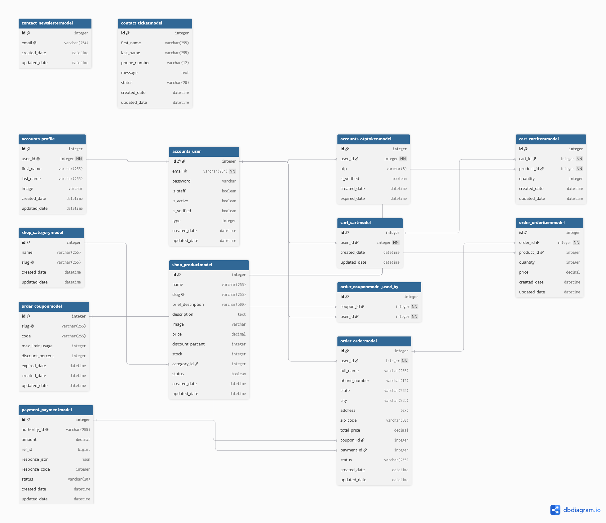

<h1 align="center">Shop REST API</h1>

<p align="center">
A RESTful e-commerce API built with Django and Django REST Framework.
</p>
<hr>

<h2>Features</h2>

<ul>
  <li>User Authentication & Authorization</li>
  <li>JWT Authentication</li>
  <li>Role-Based Permissions</li>
  <li>Product Filtering</li>
  <li>Pagination</li>
  <li>Iranian Phone Number Validation</li>
  <li>Order Management</li>
  <li>Payment Integration</li>
  <li>Admin & Customer Dashboards</li>
</ul>

<h2>Technologies</h2>

<ul>
  <li>Django</li>
  <li>Django REST Framework</li>
  <li>PostgreSQL</li>
  <li>Docker</li>
  <li>Swagger</li>
  <li>Rate Limiting</li>
</ul>

<h2>Project Structure</h2>

<pre>
api-shop/
├── core/
│   ├── core/
│   ├── account/
│   ├── shop/
│   ├── ...
│   ├── manage.py
│   └── ...
├── Dockerfile
├── docker-compose.yml
├── requirements.txt
└── README.md
</pre>


<h2>Database Schema</h2>




<h2>⚙️ Installation (Windows)</h2>

<p>Follow these steps to set up and run the project locally.</p>

<hr>

<h3>1. Clone the repository</h3>

```bash
git clone https://github.com/mhmdheydarii/API-Shop.git
```

<br>

<h3>2. Navigate to the project directory</h3>

```bash
cd API-Shop
```

<br>

<h3>3. Configure environment variables</h3>

<p>Create a .env file in the project root and add the required environment variables.</p>

```bash
SECRET_KEY=secret_key
DEBUG=True
ALLOWED_HOSTS="*"

SMTP
EMAIL_USER=your email address
EMAIL_PASSWORD=your email password
```
</br>

<h3>4. Run the project</h3>

```bash
docker compose up --build
```
<br>
<h3>5. Migrations </h3>

```bash
docker compose exec backend python manage.py migrate
```

</details>

<br>

<p align="center">
